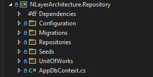
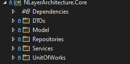
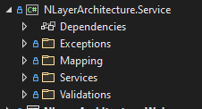
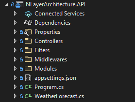
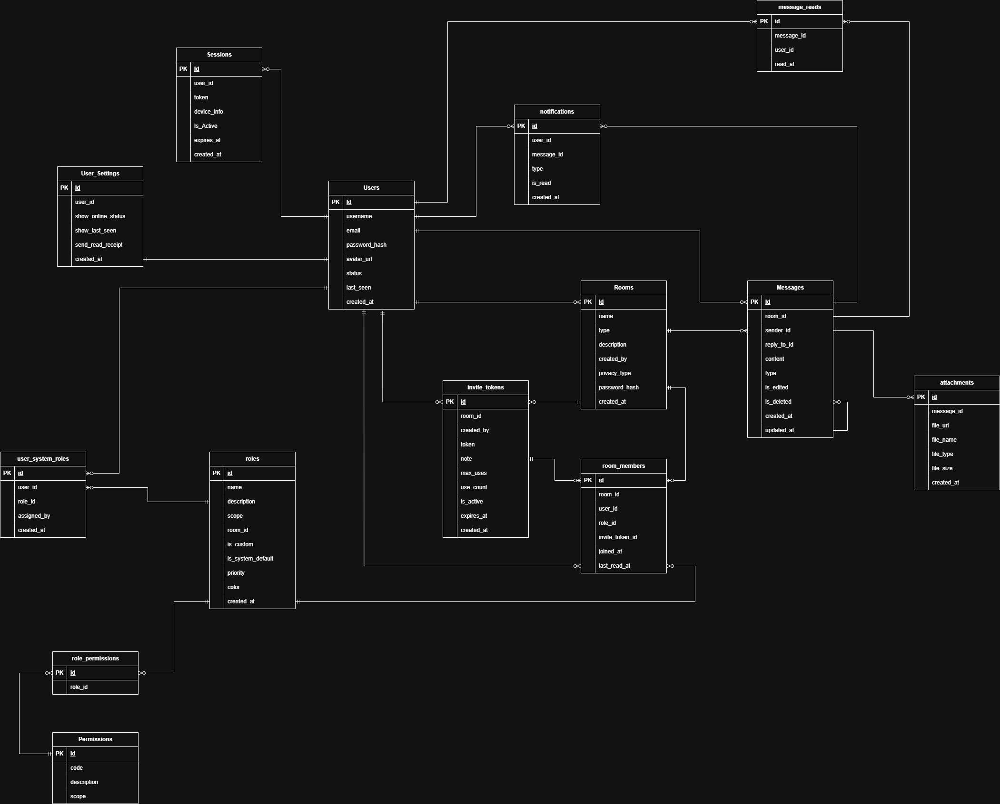

# He thong Chatapp da nen tang

## Gioi thieu du an:
-- He thong chatapp da nen tang phuc vu cho muc dich hoc tap

## cac cong nghe su dung 
*Backend* .NET 8, EF Core, PostgreSQL.
*Frontend* ReactJs(Vite), TailwindCss.
*Database* PostgreSQL 14

## Huong dan cai dat
1. Lenh Clone du an: git clone ["http"]
2. Cau hinh ConnectionString trong `appsettings.json`
3. Chay Migrations: `dotnet ef database update --project ChatApp.Repository --startup-project ChatApp.API`
4. Run du an: `dotnet run`

## Kien truc cua du an
-- Kien truc duoc xay dung tren Kien truc NLayer Architecture duoc lay cam hung tu Project `https://github.com/BerkayKulak/NLayerArchitecture`
-- gom 4 lop: API, CORE, REPOSITORY, SERVICE

*DATA ACCESS / REPOSITORY LAYER* 
- Overview: DAL (Data Access Control) la noi chiu trach nhiem ket noi voi co so du lieu 
- 

*CORE LAYER*
- Overview: Phát triển logic nghiệp vụ với sự trừu tượng hóa. Giao diện điều khiển các yêu cầu nghiệp vụ với việc triển khai đơn giản. 
- Dự án Core là trung tâm của thiết kế Kiến trúc Sạch, và tất cả các dự án phụ thuộc khác đều phải hướng về nó.
- 

*BUSINESS / SERVICE LOGIC LAYER*
- Overview: Lớp này cần xử lý tất cả logic chuyên biệt của ứng dụng, nhờ đó toàn bộ logic được tập trung tại một vị trí để dễ dàng quản lý. 
- Các phương thức CRUD nguyên tử của lớp truy cập dữ liệu có thể được sử dụng để tạo ra các kịch bản nghiệp vụ có ý nghĩa, và lớp logic nghiệp vụ này thường được thêm vào dưới dạng các dịch vụ.
- 

*API LAYER*
- Overview: Lớp API (thư viện phần mềm) không gì khác hơn là một trung gian tổng hợp tất cả các dịch vụ mà bạn cung cấp. 
- Giao diện người dùng đồ họa cung cấp sự tương tác cho người dùng, và đằng sau đó, API xử lý các hành động ở chế độ trừu tượng.
- 

## Design Entity - Relationship Model
- Mo hinh moi quan he giua cac thuc the duoc the hien nhu sau:
- 

## Design Business Flow API

## Conclude
Du an dang trong qua trinh phat trien va hoan thien cac tinh nang 

